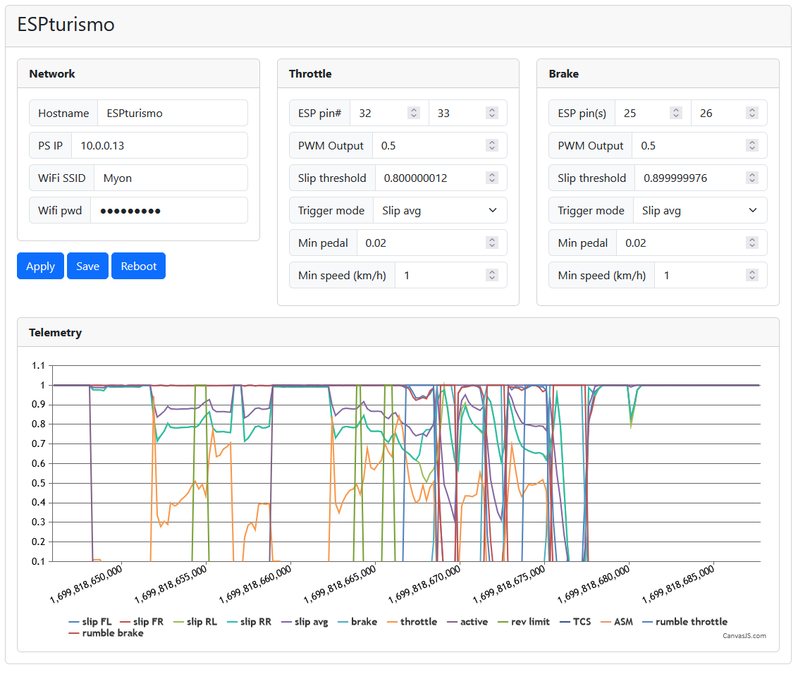

# ESPTurismo

Software for capturing telemetry from Gran Turismo 7 on an ESP32, and controlling rumble motors for pedals.

## Features:

### Rumble can be controlled by:
* Wheel slip (maximum or average of all four wheels)
* Rev limit as reported by GT7
* TCS as reported by GT7
* ASM as reported by GT7

### Rumble will not be enabled:
* If not in game
* If speed below set limit
* If pedal input below set limit

Output level can be set per pedal, to a constant level (so no dynamic rumbling as of yet).

## Hardware:
### Parts needed
* DoIT ESP32 devkit v1 (or other esp32 will do fine as well, configure the pins accordingly)
* A dual H-bridge motor controller (e.g mini L298N driver, https://www.aliexpress.com/item/33012645746.html)
* 2x rumble motors, 5-6V (e.g https://www.aliexpress.com/item/4001082464065.html)

### Connections
Connect VCC and GND from ESP32 to L298 driver, motors should run fine on 5V. Maybe add a choke on the power lines
Connect motor driver inputs to port 25,26,32 and 33
Twist the motor wires to reduce EMI, add ceramic capacitors from motor inputs to chassis

### Build and upload filesystem:
platformIO->esp32doit->Platform->Build Filesystem Image
platformIO->esp32doit->Platform->Upload Filesystem Image
platformIO->Build
platformIO->Upload

### Configuring
Connect to usb power. After one minute ESP should go into access point mode if it can't connect to WiFi.
Connect with phone to http://10.0.0.1 and configure your wifi settins along with PS4/PS5 IP address.
Click apply, save and then reboot.

Alternatively, update the settings.json in the data folder with your wifi settings.

You should now be able to connect to http://ESPturismo.local after a short while. If GT7 is running telemetry
data should show up, and you can configure your rumble motor settings.

## Sources
* https://github.com/Bornhall/gt7telemetry/blob/main/gt7telemetry.py
* https://github.com/Nenkai/PDTools/blob/master/PDTools.SimulatorInterface/SimulatorPacket.cs

One issue one might have, is electrical noise from the motors disturbing the esp32 or it's wifi reception.
I'm waiting for some capacitors for soldering between the motor connectors and the casing to reduce this,
and maybe also adding a choke between the ESP32 VCC/GND rail and the motor driver.